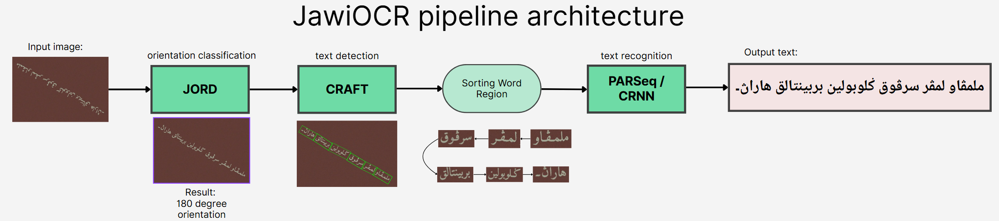

# jawiOCR

**jawiOCR** is an end-to-end Optical Character Recognition (OCR) toolkit for Jawi script (Malay in Arabic script). It integrates modern OCR components to detect text regions, correct image orientation, and recognize Jawi words. The pipeline uses **CRAFT** for text localization, a custom **JORD** model for image orientation classification, and a recognizer (either **CRNN** or **PARSeq**) for word transcription. The code is modular, so you can swap in different recognizers as needed. The project also includes synthetic Jawi datasets for training these models.



## Features

* **Text Detection (CRAFT):** Localizes word regions in the image using the CRAFT detector.
* **Orientation Classification (JORD):** Classifies image rotation (0°, 90°, 180°, 270°) so text can be upright.
* **Word Recognition (CRNN or PARSeq):** Two options for transcribing cropped word images: a Convolutional Recurrent Neural Network (CRNN) or a Permuted Autoregressive Sequence (PARSeq) transformer.
* **Synthetic Jawi Training Data:** Synthetic datasets for localization, orientation, and recognition tasks, hosted on Hugging Face.
* **Modular Design:** Components (CRAFT, JORD, CRNN, PARSeq) are decoupled and interchangeable.

## Installation

1. **Clone the repo:**

   ```bash
   git clone https://github.com/mirzasyhm/jawiOCR.git
   cd jawiOCR
   ```

2. **Create and activate a Python environment:**

   ```bash
   python3 -m venv venv
   source venv/bin/activate
   ```

3. **Install dependencies:**

   ```bash
   pip install --upgrade pip
   pip install pip-tools
   pip install -r ./jord/requirements.txt
   pip install -r ./craft/requirements.txt
   pip install -r ./crnn/requirements.txt

   cd /content/jawiOCR/parseq_jawi/
   make clean-reqs reqs

   platform = "cu121"

   make torch-{platform}
   pip install -r requirements/core.{platform}.txt -e .[train,test]
   cd ..
   ```

   *(The `requirements.txt` includes PyTorch, TensorFlow, OpenCV, and other necessary libraries.)*

## Pretrained Models & Checkpoints

Pretrained checkpoints are available on Hugging Face:

* **All model checkpoints:** [https://huggingface.co/datasets/mirzasyhm/checkpoint\_jawi/tree/main](https://huggingface.co/datasets/mirzasyhm/checkpoint_jawi/tree/main)

Download the relevant `.pth`, `.ckpt`, or `.keras` files and place them in a local `models/` directory.

## Demo, Training & Testing

Refer to the Jupyter notebooks in the repository for detailed instructions and example workflows:

* **Notebooks:** 
 `end2end_crnn.ipynb`, `end2end_parseq.ipynb`, `crnn.ipynb`, `jord.ipynb`, `craft.ipynb`, `parseq.ipynb`

These notebooks cover data preparation, training commands, and inference examples for all components.

## Running Inference

Example command using CRNN:

```bash
python jawiocr_crnn.py \
  --image_path /path/to/image.jpg \
  --craft_model_path models/craft.pth \
  --crnn_model_path models/crnn.pth \
  --alphabet_path models/alphabet.json \
  --orientation_model_path models/orient.h5 \
  --output_dir ./results/
```

Example command using PARSeq:

```bash
python jawiocr_parseq.py \
  --image_path /path/to/image.jpg \
  --craft_model_path models/craft.pth \
  --parseq_model_path models/parseq.ckpt \
  --orientation_model_path models/orient.h5 \
  --output_dir ./results/
```

## Training

Detailed training examples are provided in the `train.ipynb` notebook. In summary:

* **JORD:** Train on the Jawi orientation dataset with:

  ```bash
  cd jord
  python train.py
  ```
* **CRAFT:** Train on localization data via the CRAFT notebook or:

  ```bash
  cd craft
  python train.py --config craft/config/syn_train.yaml
  ```
* **CRNN:** Train using the synthetic word dataset:

  ```bash
  cd crnn
  python train.py
  ```
* **PARSeq:** Fine-tune a PARSeq model:

  ```bash
  cd parseq_jawi
  python train.py +experiment=parseq-tiny
  ```

## Datasets

All synthetic Jawi datasets are hosted on Hugging Face:

* **Synthetic Jawi Images:** [https://huggingface.co/datasets/mirzasyhm/synthetic\_jawi\_images/tree/main](https://huggingface.co/datasets/mirzasyhm/synthetic_jawi_images/tree/main)

The datasets include:

* Word-level images for CRNN/PARSeq (LMDB format)
* Orientation-labeled images for JORD
* Localization examples for CRAFT

## License

This project is licensed under the **Apache License 2.0**. See [LICENSE](LICENSE) for details.

---

